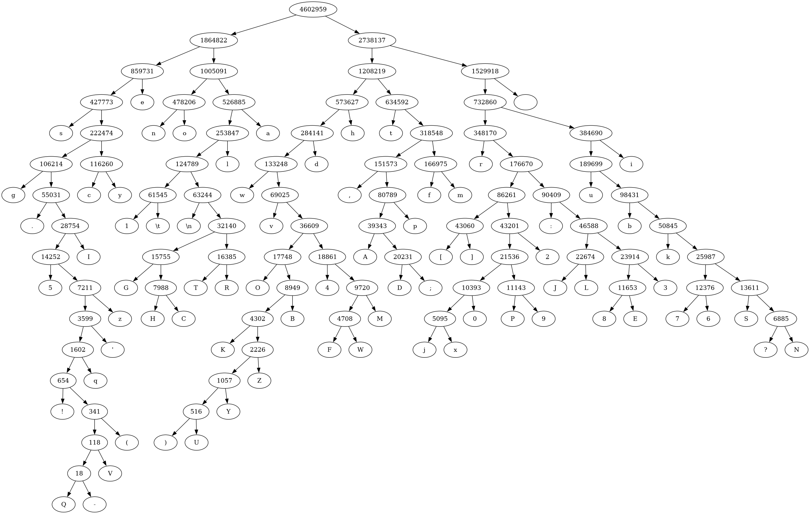
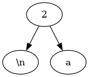
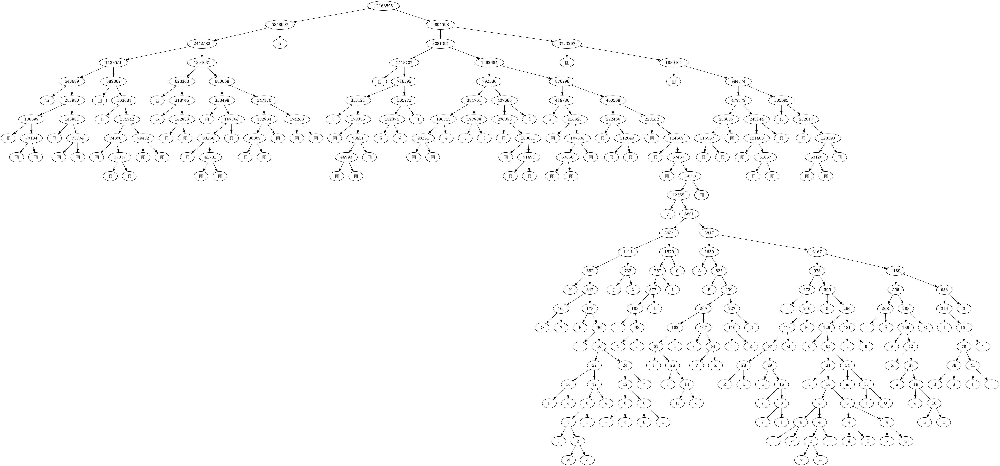
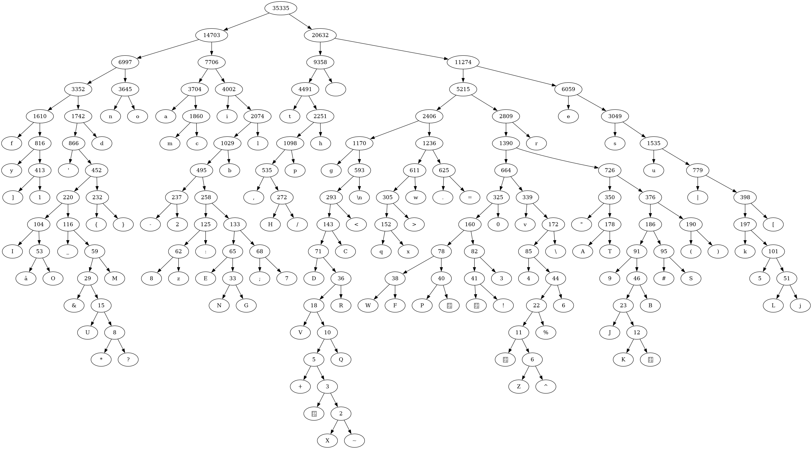

## Compilação
Clone o repositório:
```
git clone https://github.com/silva-guimaraes/huffman-coding/ 
```
Faça a compilação:
```
./build.sh
```
## Teste
```
./test.sh
```
Executa todos os testes feitos logo abaixo.
## Visualização
Requer uma ferramenta de visualização chamada [graphviz](https://graphviz.org/) como dependência. Gere a árvore da codificação com:
```
./graph.sh arquivo.txt
```
Gera uma imagem "output.png" no seu diretório atual.
## Uso
Para codificar:
```
./main < arquivo.txt
```
Gera um arquivo "output.huff" como resultado.

Para decodificar:
```
./main output.huff
```
## Formatação
Formatação dos arquivos gerados:
| Tamanho (em bytes) | Uso                                                                                                                 |
|--------------------|---------------------------------------------------------------------------------------------------------------------|
| 4                  | magic number. diz se arquivo foi comprimido com a nossa codificação                                                 |
| 4                  | tamanho da tabela de frequência (N)                                                                                 |
| 8                  | tamanho em bytes do arquivo original, descomprimido                                                                 |
| (1 + 4) * N        | tabela de frequência. char + int * tamanho da tabela de frequência, onde char é o caractere e int a frequência dele |
| variado            | bits comprimidos                                                                                                    |

## Benchmarks
### Arquivos:
Testes feitos com os arquivos presentes na pasta `input`:
<dl>
  <dt>
    huffman_wiki.txt
  </dt>
  <dd>
    Página da Wikipedia em inglês sobre a codificação de Huffman. 
  </dd>
  <dt>
    ffmpeg_doc.txt
  </dt>
  <dd>
    Documentação do ffmpeg, um programa bem extenso para codificação de videos, de acordo com a man page do própio. 
  </dd>
  <dt>
    biblia.txt
  </dt>
  <dd>
    A Biblia completa em inglês versão King James.
  </dd>
  <dt>
    a.txt
  </dt>
  <dd>
    Um arquivo de texto com apenas dois caracteres, um "a" e um newline.
  </dd>
  <dt>
    rance10_script.txt
  </dt>
  <dd>
    Script da visual novel com o maior conteúdo de acordo com o reddit, <a href="https://vndb.org/v20802">Rance Ⅹ -決戦-</a>, totalizando 168 horas de jogo no total, em Japonês.
  </dd>
</dl>

### Specs:

**Todos os testes a seguir foram executados em uma maquina com as seguintes especificações:**
- CPU: 12th Gen Intel i5-1235U (12 núcleos) @ 4.400GHz clock
- GPU (Integrada): Intel Alder Lake-UP3 GT2 (Iris Xe Graphics)
- Memória: 15,3G disponíveis.

### Formulas:
A razão de compressão indica a porcentagem de redução no tamanho do arquivo original após a compressão e é uma medida relativa. A taxa de compressão denota quantas vezes menor é o tamanho do arquivo comprimido em relação ao tamanho do arquivo original e é uma medida absoluta. Segue as formulas usada para calcular as duas métricas:

$\text{Taxa de compressão} = \frac{\text{Tamanho original}}{\text{Tamanho comprimido}}$

$\text{Razão de compressão} = 1 - \frac{\text{Tamanho comprimido}}{\text{Tamanho original}}$

### Resultados:

| Arquivo            | Linhas  | Tamanho original        | Tamanho compresso      | Taxa de compressão | Razão de compressão | Tempo compressão | Tempo descompressão | Codificação |
|--------------------|---------|-------------------------|------------------------|--------------------|---------------------|------------------|---------------------|-------------|
| huffman_wiki.txt   | 300     | 35.335 bytes (35K)      | 22.528 (22K)           | 156,85%            | 36,24%              | 0,004 segundos   | 0,004 segundos      | ASCII       |
| ffmpeg_doc.txt     | 2.328   | 122.355 bytes (120K)    | 66.869 bytes (66K)     | 182,98%            | 45,35%              | 0,004 segundos   | 0,007 segundos      | ASCII       |
| biblia.txt         | 31.104  | 4.602.959 bytes (4,4 M) | 2.676.259 bytes (2,6M) | 171,99%            | 41,86%              | 0,181 segundos   | 0,142 segundos      | ASCII       |
| a.txt              | 1       | 2 bytes                 | 27 bytes               | 7,41%              | -1250%              | 0,002 segundos   | 0,002 segundos      | ASCII       |
| rance10_script.txt | 264.709 | 12.163.505 bytes (12M)  | 7.142.366 bytes (6,9M) | 170,30%            | 41,28%              | 0,295 segundos   | 0,329 segundos      | UTF-8*      |

*O programa não é capaz de interpretar UTF-8. bytes individuais e arbitrários foram tratados como caracteres.
### Árvores resultantes:
- biblia.txt



- ffmpeg_doc.txt


- a.txt



- rance10_script.txt


Curiosamente, todos os caracteres ascii ficam quase que completamente isolados de todo o resto neste caso.

- huffman_wiki.txt


